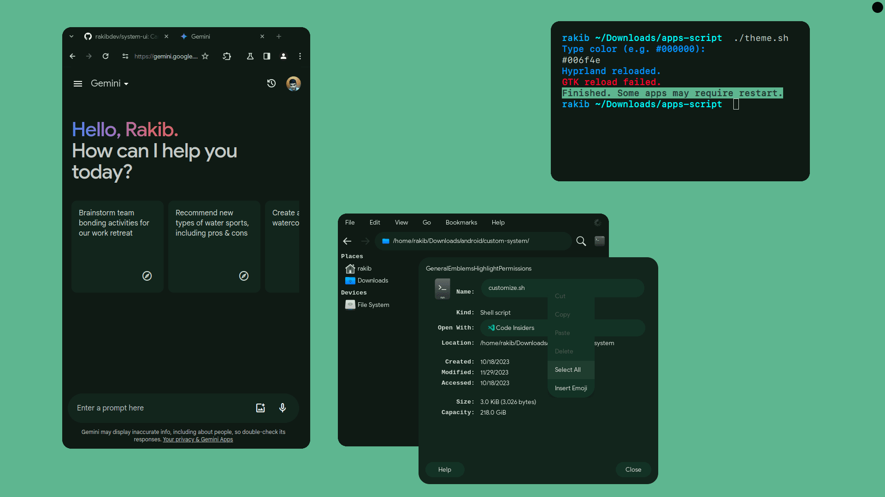
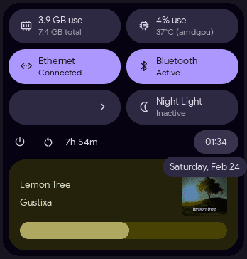
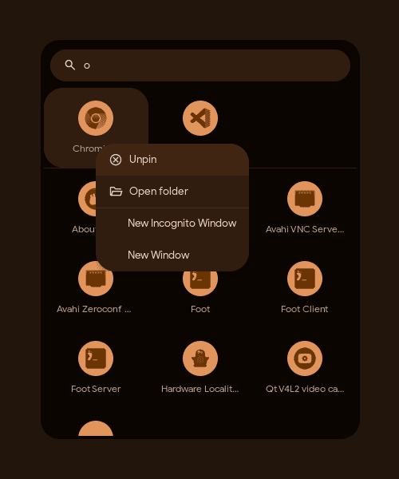

You see a black dot at top right corner? Hovering it smoothly reveals the panel. For a seamless fullscreen experience. No more taskbar distractions!

### Panel



### Launcher



## Installation

Required

- gtk3
- gtk-layer-shell
- pipewire

Optional

- bluez
- networkmanager
- hyprland (night light)
- ttf-material-symbols-variable-git (icons)

```
xmake config --mode=release
```

```
xmake build
xmake install --admin
```

```
xmake uninstall --admin
```

## Extensions

Highly extensible. Launcher, panel are extensions too. Generally extensions can be seen as GTK windows with access to System UI framework APIs.

### Create

See [demo extension](demo/extension/) and [built-in extensions](extensions/).

### Use

Put compiled `.so` files in `~/.config/system-ui/extensions`.

## Theming

## CSS

## Build

TODO:
