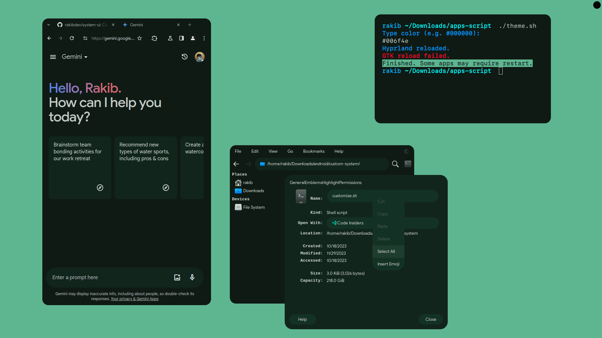
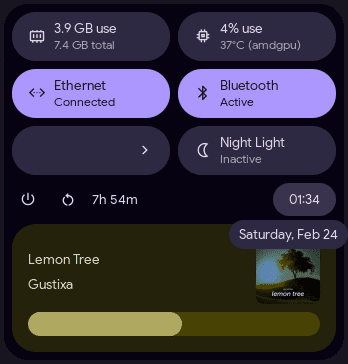
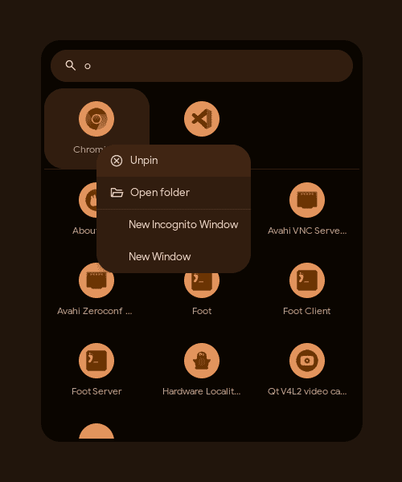
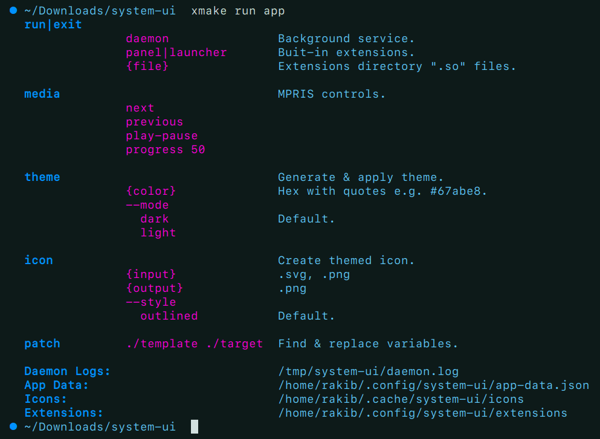

Notice a black dot at top right corner? Hovering it smoothly reveals the panel. For a seamless fullscreen experience. No more taskbar distractions.

### Panel



### Launcher



### CLI Interface



## Installation

Required

- gtk3
- gtk-layer-shell
- pipewire

Optional

- bluez
- networkmanager
- hyprland (Night Light)
- ttf-material-symbols-variable-git (Icons)

```
xmake config --mode=release
```

```
xmake build
xmake install --admin
```

```
xmake uninstall --admin
```

## Extensions

Generally extensions can be seen as GTK windows with access to System UI framework APIs.

### Develop

For guidance on creating and debugging extensions, refer to a [system-ui-extensions](link) repo.

### Usage

Place compiled .so files in the following directory:

```
~/.config/system-ui/extensions
```


- network/bluetooth live PropertiesChanged subscription left as TODO — no moc-free signal relay exists; initial state + method calls work. Only affects panel (out of your launcher+system-ui scope). media live updates work via QDBusServiceWatcher.
- Panel/media/theme extensions not migrated (separate targets, not requested) — they won't build until ported.
- Runtime not started (you launch the daemon). Recommend: ./build/ui --serve then ./build/ui ./build/launcher.so toggle.